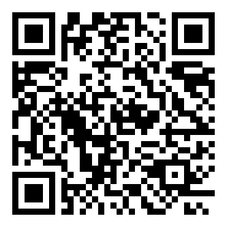
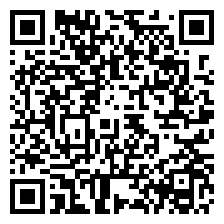
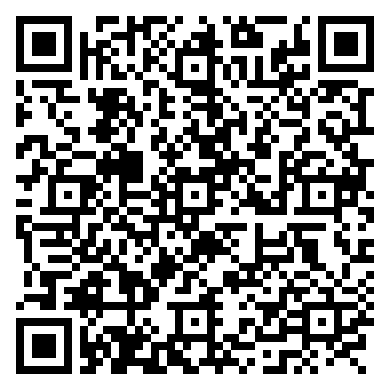
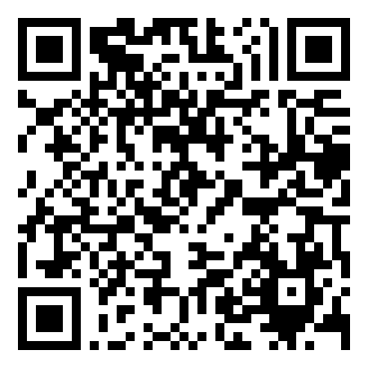

# Support the Project

This app is completely free. It comes without any ads or other forms of commercial monetization. To support ongoing development or simply say thanks, consider making a donation.

Thank you for your support!

---

### 
**Address:** `bc1qtxjs9h3yulfhxgpr6ppckv0f6pxgtlx8jat6hy`

  
<b>Show QR Code</b>

   
  

---

### 
**Address:** `8BEKm3Dd7urgZs1rvYRGLQ8N6jQVkdhZ2VBg6TRdb5BDH87VUGPXThXTTKAM2aUWRmcGTnMX4tC29G5hnvr6mYv2EAxxCP5`

  
<b>Show QR Code</b>

   
  

---

### -26A17B?style=for-the-badge&logo=tether&logoColor=white)
**Address:** `0x0D99a9060e374356Ac2bCb26456d0f33EbB33D31`

  
<b>Show QR Code</b>

   
  

---

### -26A17B?style=for-the-badge&logo=tether&logoColor=white)
**Address:** `TZEPGkXT71azVoHKUUrv94eWtLLhpXJeVR`

  
<b>Show QR Code</b>

   
  

---