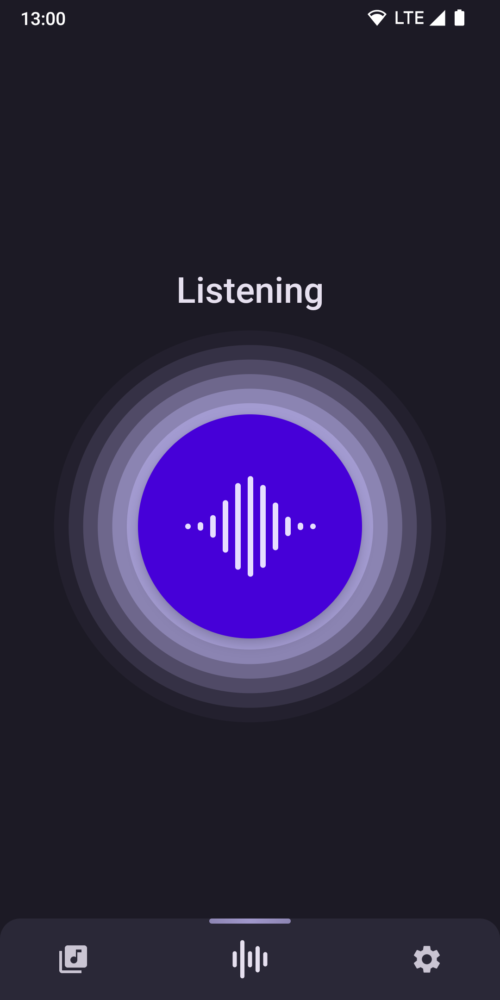
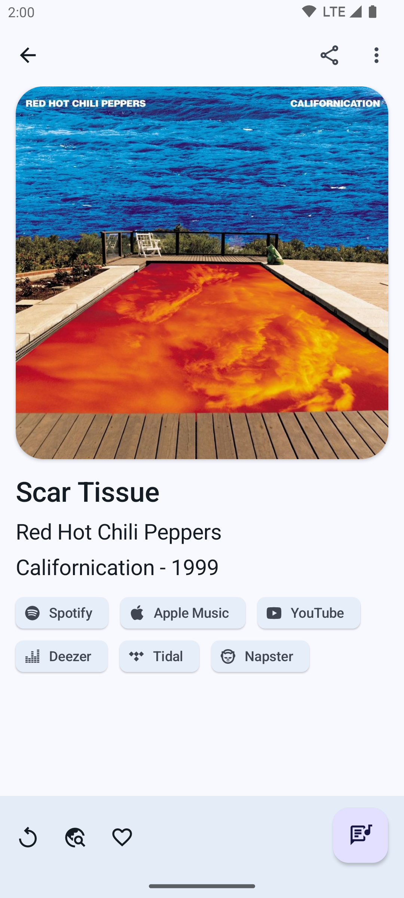
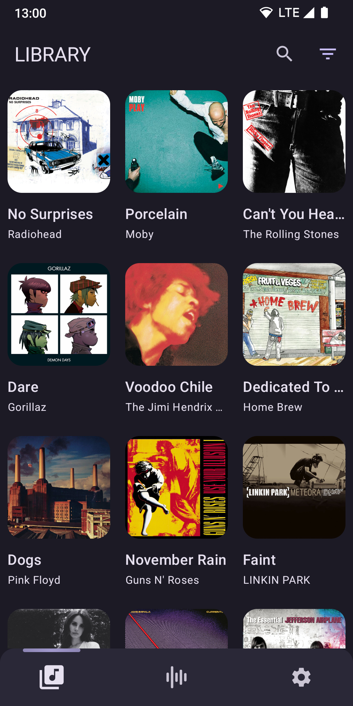
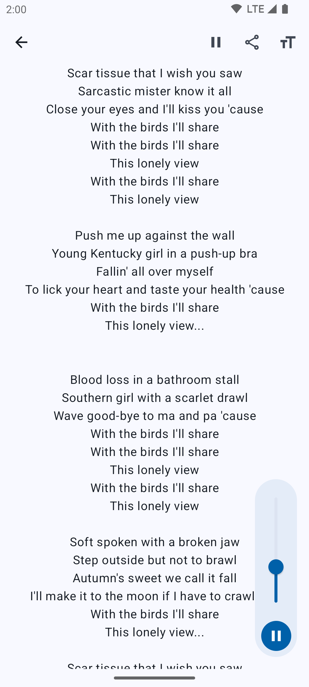
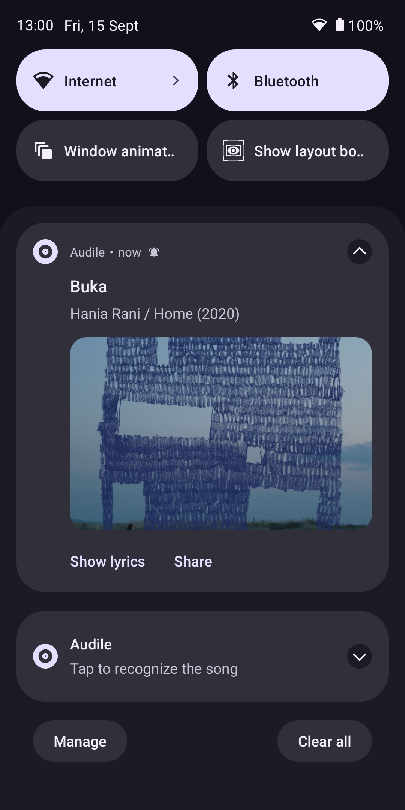
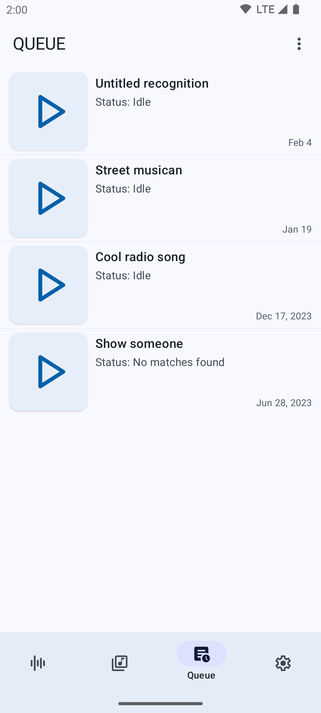
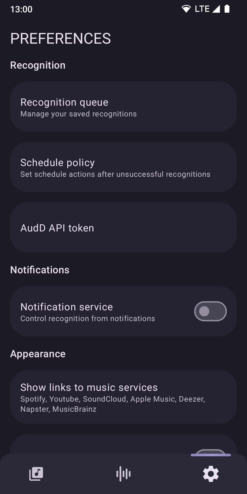

# Audile

Audile is a music recognition application, that can help you quickly and accurately recognize a music track playing nearby you.
This application uses the AudD® service as a Music Recognition API.

I'm developing this application as a pet project where I can improve my coding skills. At the same time, I try to make the app reliable for everyday use.

If you would like to contribute or translate, that is appreciated.

## Features

* **Recognition** - Audile allows you to perform song recognition in one click. The app will save the recording if there is no internet, and the recognition process will be executed when you come back online. You can customize the default behavior for unsuccessful recognition (no internet, no matches, another failure) via the preferences.
* **Notification service** - You can use the application from the notification drawer. Manage the recognition process and receive information about the track.
* **About track** - In case of successful recognition, information about the track, such as the name, artist, album and year, artwork, links to this track on popular music services, lyrics is provided.
* **Library** - All recognized tracks are stored in the application's library. You can filter the track list, create a favorites collection, search for tracks, or delete tracks.
* **Preferences** - The application has a number of options for customizing its behavior and appearance, which can be found on the settings screen.

## Tech

Audile is written in Kotlin and runs on Android 8.0 or higher.  
App architecture inspired by clean arch practices. The application is modularized with a feature-based approach (definitely overkill for such small app).  
UI completely written in Jetpack Compose with MVVM pattern in Material3 design.  
The app uses the AudioRecord/MediaCodec API for audio recording and encoding.  
Stack: Kotlin, Coroutines, Jetpack Compose, Hilt, WorkManager, Room, OkHttp, Moshi, DataStore, Coil, Junit.  

## Screenshots

## API Key

This application uses the AudD® service as a Music Recognition API. You need a special API token provided by AudD® to use the application. If you don't have one, you can sign up for a free API token.
You can add the key on the onboarding or preferences screen, or just set it in `local.properties`.

There is also the option to use the app without a token, but please note that this will restrict the number of daily recognitions that can be performed.

## License

Copyright (C) 2023 [Aleksey Saenko].

The license is [GNU GPLv3](LICENSE.md).
